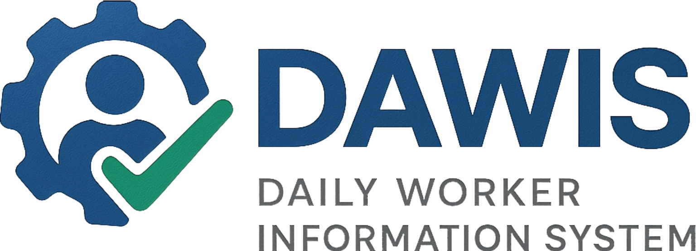

# DAWIS

<p align="center">
      
</p>

## Introduction

DAWIS is an attendance and wage management system for daily workers.


## Tools
- Intellij IDEA
- pgAdmin 4
- Postman
## Tech Stack

- Java
- Spring Boot
- PostgreSQL
- Lombok
- Maven
- BCrypt


## Requirements
- Java 17+
- Maven 3.8+
- PostgreSQL 14+
## Installation

### Clone

```bash
git clone https://github.com/sasembodo/dawis.git
cd dawis
```

### Import Maven Project
    1. Open project using IntelliJ IDEA
    2. Right click on pom.xml
    3. Select Add as Maven Project
    4. Wait until Maven finishes downloading dependencies


### Setup on application.properties
```bash
spring.datasource.username={your_db_username}
spring.datasource.password={your_db_password}
```

### Run Application

```bash
./mvnw spring-boot:run
```


## API Reference (Postman)

[DAWIS App Collection](https://web.postman.co/workspace/My-Workspace~59fc4651-2f78-4cc5-8feb-bcc4cb799e3b/collection/15433848-1cbd82a8-d11a-4e0f-a04c-65c99a36c9bc?action=share&source=copy-link&creator=15433848)

    
## Authors

[@sasembodo](https://www.github.com/sasembodo)


## License

[MIT](https://github.com/sasembodo/dawis/blob/master/LICENSE)

© Sri Aryo Sembodo
